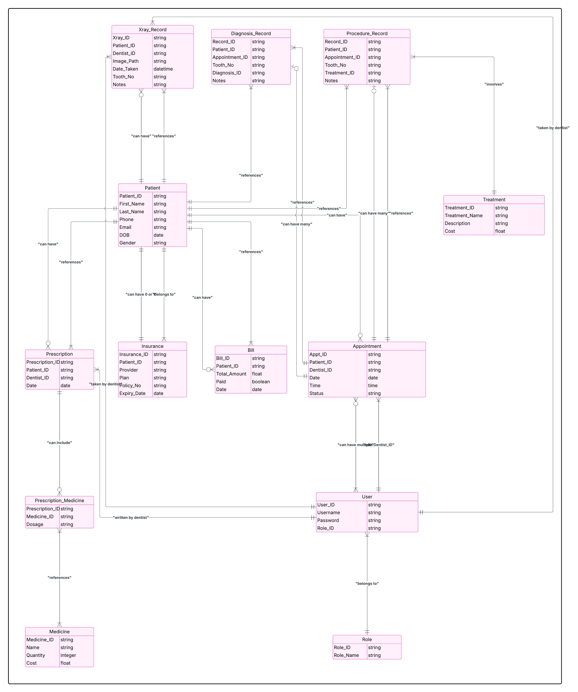

**Dental Clinical Management System**

An SQL-based secure and scalable system for managing the operations of a dental clinic. This includes managing patients, appointments, treatments, billing, X-ray records, prescriptions, and role-based staff access, and administrator-controlled access.

**Table of Contents**

1. Features
2. Tech Stack
3. Database Design
4. Installation
5. Running the Project
6. Sample Queries
7. Security
8. Future Enhancements

**Features**

Patient Management, Appointment Scheduling, Treatment Records, Secure Prescription & Billing, X-ray Image Recording, Insurance Details Management, Role-based Access Control, Data Encryption, Administrative Controls, Analytical SQL Queries

**Tech Stack**

**Component**                                 **  Tool**

Database                                       MySQL
SQL IDE                                        VSCode + SQLTools
Diagramming                                    Lucidchart

**Database Design**
 ER Diagram
 

**Installation**

1. MySQL Installation
Create an Oracle account
Download and install MySQL community server
Start MySQL sercer
Login to MySQL using terminal:
'/usr/local/mysql/bin/mysql -u root -p'
Use the configured password

2. VSCode setup
Install the extensions in VSCode SQLTools, SQLTools MySQL/MariaDB Driver

3. Connect VSCode to MySQL
Click the SQLTools icon in sidebar
Add new connection
- Connection Name: DentalDB
- Server/Host: localhost
- User: root
- Password: your_password
- Database: dental_clinic

 ** 4. Running the Project**

 1. Create the Database
- In MySQL terminal or SQLTools in VS Code

  CREATE DATABASE dental_clinic;
  USE dental_clinic;

  2. Load Schema
  - Open Schema.sql in VS Code
  - Run the Query
  - This creates all the necessary tables

  3. Insert Sample Data
  - Open sampledata.sql
  - Run the Query
    
**Sample Query Scenarios**

1. Total Revenue Generated in April 2025

'SELECT SUM(Total_Amount) AS Total_Revenue
FROM Bill
WHERE Date BETWEEN '2025-04-01' AND '2025-04-30';'

2. List of Patients Who Have Appointments with Dr. John
   
'SELECT P.First_Name, P.Last_Name, A.Date, A.Time
FROM Appointment A
JOIN Patient P ON A.Patient_ID = P.Patient_ID
WHERE A.Dentist_ID = 'U001';'

4. Treatments Performed on Each Patient
   
'SELECT P.First_Name, P.Last_Name, T.Treatment_Name, PR.Tooth_No, PR.Notes
FROM Procedure_Record PR
JOIN Patient P ON PR.Patient_ID = P.Patient_ID
JOIN Treatment T ON PR.Treatment_ID = T.Treatment_ID;'

6. List of Patients Prescribed ‘Ibuprofen’

'SELECT DISTINCT P.First_Name, P.Last_Name
FROM Prescription PR
JOIN Prescription_Medicine PM ON PR.Prescription_ID = PM.Prescription_ID
JOIN Medicine M ON PM.Medicine_ID = M.Medicine_ID
JOIN Patient P ON PR.Patient_ID = P.Patient_ID
WHERE M.Name = 'Ibuprofen';'

7. Unpaid Bills and Corresponding Patients

'SELECT P.First_Name, P.Last_Name, B.Total_Amount, B.Date
FROM Bill B
JOIN Patient P ON B.Patient_ID = P.Patient_ID
WHERE B.Paid = FALSE;'

8. Prescription Details for a Given Patient (e.g., Bob Johnson)

'SELECT M.Name AS Medicine, PM.Dosage
FROM Prescription PR
JOIN Prescription_Medicine PM ON PR.Prescription_ID = PM.Prescription_ID
JOIN Medicine M ON PM.Medicine_ID = M.Medicine_ID
WHERE PR.Patient_ID = 'P002';'

9. All Procedures Performed by a Particular Dentist

'SELECT T.Treatment_Name, PR.Tooth_No, P.First_Name AS Patient, A.Date
FROM Procedure_Record PR
JOIN Treatment T ON PR.Treatment_ID = T.Treatment_ID
JOIN Appointment A ON PR.Appointment_ID = A.Appt_ID
JOIN Patient P ON PR.Patient_ID = P.Patient_ID
WHERE A.Dentist_ID = 'U001';'

10. X-ray Records with Notes for All Patients

'SELECT P.First_Name, P.Last_Name, XR.Tooth_No, XR.Image_Path, XR.Notes, XR.Date_Taken
FROM Xray_Record XR
JOIN Patient P ON XR.Patient_ID = P.Patient_ID;'

11. Patients with Active Insurance Policies

'SELECT P.First_Name, P.Last_Name, I.Provider, I.Policy_No, I.Expiry_Date
FROM Insurance I
JOIN Patient P ON I.Patient_ID = P.Patient_ID
WHERE I.Expiry_Date > CURDATE();'

12. List All Users and Their Roles

'SELECT U.Username, R.Role_Name
FROM User U
JOIN Role R ON U.Role_ID = R.Role_ID;'

**User Approval Workflow:**

Only two admin users can approve or reject registration requests.
Logs all registration attempts.
Roles assigned upon approval.

**Future Enhancements**

-Frontend UI using Flask or Django
-Visual Dashboards for revenue, treatment trends (Power BI/Tableau)
-Encryption of X-ray files and patient data
-Activity Logging and Audit Trail System
-SMS/Email Reminders for Appointments

Repository Structure

📁 dental-clinic-management/
├── schema.sql              # Full table structure
├── sampledata.sql          # Sample INSERT statements
├── README.md               # This documentation
└── /diagrams               # (Optional) EER or schema diagrams

Author
Eswar Prabhath Kamisetti
ekamiset@gmail.com
